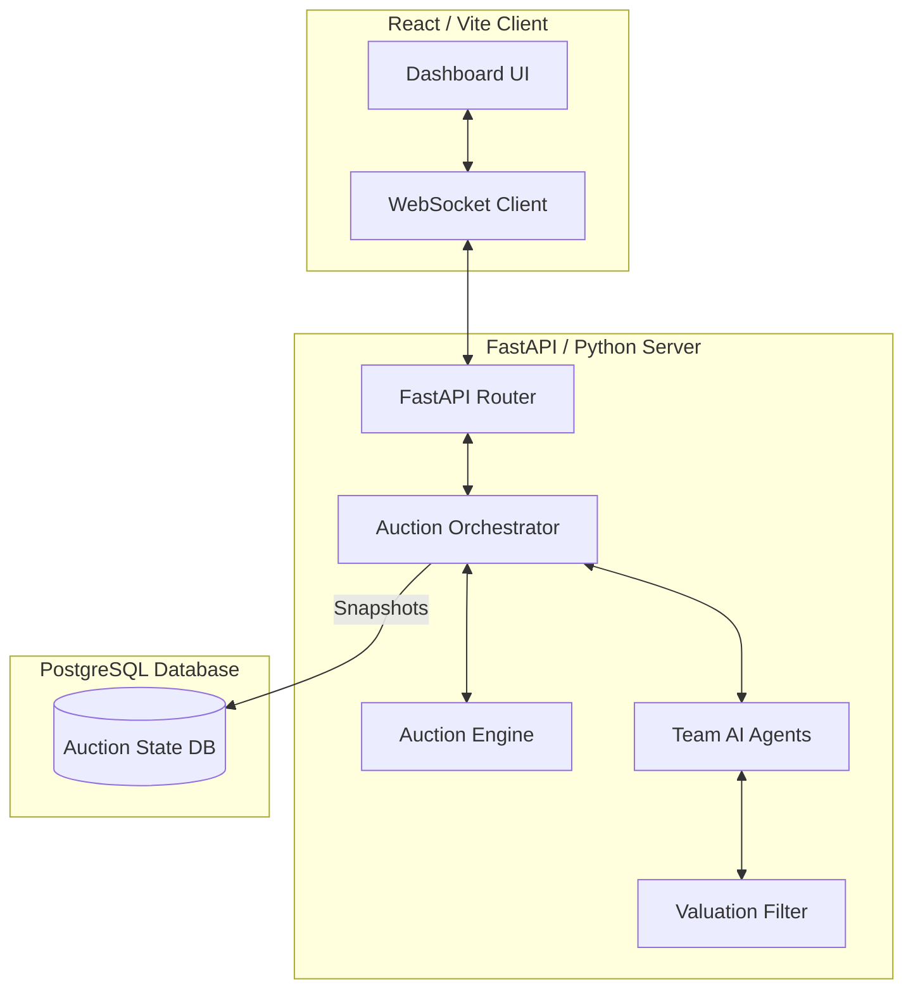

# IPL Auction Simulator 2026

A high-fidelity, real-time simulation engine designed to replicate the complexities and strategic nuances of an IPL Mega Auction. This project uses heuristic-driven AI agents, a sophisticated valuation engine, and a real-time event-driven architecture to provide a production-grade auction experience.

---

## 1. System Architecture

The simulator follows a full-stack asynchronous architecture, separating the heavy heuristic calculations from the real-time user interface.



---

## 2. Core Components

### 2.1 Auction Orchestrator (`agents/orchestrator.py`)
The Orchestrator is the central coordinator of the application. It operates in a dedicated background thread to ensure the auction logic does not block the web server's event loop. It manages:
- The bidding loop for each player.
- Synchronization between AI decisions and human input.
- Real-time broadcasting of auction events (bids, sales, hammer warnings).
- The "Accelerated Phase" where unsold players are re-introduced based on team demand.

### 2.2 Auction Engine (`engine/auction_engine.py`)
The Engine serves as the strict state machine for the auction rules. It handles:
- Validating bid increments according to official IPL slabs.
- Managing the Right to Match (RTM) logic, including the "Final Raise" mechanism.
- Enforcing squad constraints (minimum 18, maximum 25 players) and overseas player limits (maximum 8).
- Transitioning player state from Unsold to Sold or Retained.

### 2.3 Team AI Agents (`agents/team_agent.py`)
There are 10 distinct AI agents, each representing a franchise. These agents are not simple random-number generators; they are heuristic engines with unique personality profiles:
- **Personality Profiles**: Stored in `data/team_profiles.json`, these define biases like "Veteran Bias," "Youth Bias," and "Aggression."
- **Strategic Price Driving**: Agents can detect when a rival is close to their limit and will intentionally bid to inflate the cost for that rival.
- **Decision Matrix**: Agents evaluate every player based on their own current squad needs, remaining budget, and the current market scarcity.

### 2.4 Valuation Filter (`tools/valuation_filter.py`)
The "Brain" of the simulator. It uses a multi-layered heuristic to calculate a player's market value in real-time. Key factors include:
- **Base Merit**: Derived from the player's Tier and recent performance metrics.
- **Scarcity Index**: Dynamically adjusts prices upward if the remaining pool of a specific role (e.g., Wicket Keepers) is low.
- **Role Desperation**: Multiplies valuation if a team has zero players in a critical role.
- **Absolute Market Ceiling**: Enforces a hard ₹30 Crore cap on all bids to maintain auction balance and prevent runaway inflation.

---

## 3. Realism Philosophy and Design Decisions

The primary goal of this simulator is to move beyond simple "top-down" bidding and replicate the volatile psychology of a real IPL auction. Several key design decisions were made to achieve this:

### 3.1 Dynamic Market Scarcity (The "Supply-Demand" Logic)
Most simulators use static valuations. This project implements a **Dynamic Scarcity Index**.
- **The Problem**: In a real auction, the 10th-best bowler is worth more if there are 0 bowlers left than the 1st-best bowler was at the start.
- **The Solution**: The `ValuationFilter` tracks the remaining pool. If the "Bowler" role is 80% depleted, every team’s valuation for the remaining bowlers increases exponentially. This mimics the "Panic Buying" phase seen in the middle and late stages of the Mega Auction.

### 3.2 Strategic Price Driving (The "Adversarial" AI)
A major innovation in this simulator is that AI agents do not just bid to win; they bid to **weaken their rivals**.
- **Strategic Calculation**: If an agent (e.g., MI) sees a rival (e.g., CSK) desperate for an opener, and the price is still safe, MI will intentionally keep bidding to drive the price up. 
- **The "Troll" Limit**: The AI calculates a "Risk Cap" to ensure it stops bidding before it accidentally wins a player it doesn't actually want.

### 3.3 The ₹30 Crore Absolute Ceiling
- **Thought Process**: After observing simulations where teams spent 60% of their budget on one player (e.g., KL Rahul), we implemented a hard market cap.
- **Realism Rationale**: In the 2025/2026 auction environment, squad depth (18-25 players) is more valuable than any single player. The ₹30 Cr cap ensures that the AI preserves enough "Purse Health" to build a competitive 11-man starting lineup and a solid bench.

### 3.4 Contextual Desperation (Panic Multipliers)
AI agents don't just look at a player's skill; they look at their own "Squad Holes."
- **Need-Based Inflation**: If a team has zero Wicket Keepers and the "Star" WKs are almost gone, that team’s `Desperation Multiplier` can inflate their bid by up to 2.2x. This creates the "outlier" bids that make the auction feel alive and unpredictable.

### 3.5 Squad Redundancy Penalties
To prevent "unbalanced" teams, the agents use a diminishing returns model:
- **Picking your 1st Batter**: 100% Valuation.
- **Picking your 6th Batter**: 60% Valuation.
- **Picking your 9th Batter**: 20% Valuation (AI essentially stops bidding).
This forces teams to pivot their strategy mid-auction once they have filled specific slots.

### 3.6 Right to Match (RTM) and the Final Raise
We implemented the 2025 rule changes precisely:
- **The Chess Match**: When a team uses RTM, the buying team gets a "Final Raise" opportunity. The AI is programmed to calculate if a small raise will "scare off" the RTM team or if they should just take the player at the current price.

---

## 4. Codebase Structure

```text
IPLAuctionSimulator/
├── agents/
│   ├── orchestrator.py      # Main auction loop and event broadcasting
│   ├── team_agent.py        # AI decision logic and personalities
│   └── human_agent.py       # Human input bridge
├── backend/
│   ├── main.py              # FastAPI endpoints and WebSocket management
│   └── keep_alive.py        # Render free-tier stability script
├── database/
│   ├── models.py            # SQLAlchemy schemas (Sessions, Snapshots)
│   └── db_manager.py        # PostgreSQL CRUD operations
├── engine/
│   ├── auction_engine.py    # IPL rules and state transitions
│   └── state.py             # Pydantic models for AuctionState, Player, Team
├── tools/
│   └── valuation_filter.py  # Core mathematical valuation logic
├── data/
│   ├── mock_players.json    # Initial player pool
│   └── team_profiles.json   # AI personality configurations
├── frontend/
│   ├── src/
│   │   ├── App.jsx          # Main React dashboard
│   │   └── index.css        # Premium styling and animations
│   └── index.html           # Entry point
├── render.yaml              # Render Blueprint deployment config
└── vercel.json              # Vercel SPA routing config
```

---

## 5. Local Setup and Execution

### 5.1 Prerequisites
- Python 3.10+
- Node.js 18+ and npm
- (Optional) PostgreSQL

### 5.2 Backend Setup
1. Navigate to the project root.
2. Create and activate a virtual environment:
   ```bash
   python -m venv .venv
   source .venv/bin/activate  # Windows: .venv\Scripts\activate
   ```
3. Install dependencies:
   ```bash
   pip install -r requirements.txt
   ```
4. Start the FastAPI server:
   ```bash
   uvicorn backend.main:app --host 0.0.0.0 --port 8000 --reload
   ```
   Note: On the first run, the system will automatically create a local SQLite database (`auction_local.db`) if no PostgreSQL `DATABASE_URL` is provided.

### 5.3 Frontend Setup
1. Navigate to the `frontend/` directory.
2. Install dependencies:
   ```bash
   npm install
   ```
3. Start the Vite development server:
   ```bash
   npm run dev
   ```
4. Open your browser to the URL provided by Vite (usually `http://localhost:5173`).

---

## 6. Screenshots and Visuals

![Auction Dashboard Dashboard Placeholder]
(Add your dashboard screenshot here)

![Team Management Placeholder]
(Add your team squad screenshot here)

---

## 7. Performance Optimizations
The system is tuned for Render's 512MB RAM free tier:
- **Debounced Broadcasting**: In "Fast" mode, non-essential WebSocket messages are throttled to reduce memory pressure.
- **Snapshot Debouncing**: Database I/O is limited to minimize CPU spikes.
- **Memory Breathers**: Forced delays between players allow the Python garbage collector to optimize RAM usage during high-speed simulations.
